## Introduction

On developing a database of our own, it is essential that we have access to records stored in the disk without much time delay. Disk access is a high-latency operation. Therefore, as the size of relation increases, searching records that satisfy certain conditions by accessing every record in the disk blocks, can adversely affect the performance. This necessitates indexing.

## Understanding Indexing

Creating an index on an attribute of a relation is basically creating a data structure that holds the attribute value and a pointer to the records. It enables us to speed up the retrieval of records in response to certain search conditions on the attribute value. An **index** in a database is very much like the index in a book. And, just as a book's index points to locations within the book, a database's index points to records within the disk. The database organizes the indices such that these pointer values can be found extremely fast. And, once the database has located the desired set of pointer values, it can then turn around and quickly read the full record. In the end, a database index is a means to locate and read table data as quickly as possible.

The objective of creating an index on an (attribute, relation) pair, is to make search operation on a relation for records with attribute value that satisfy a search condition, faster than linear search on the blocks of the file. If n is the number of records in a file, the time required to search based on an attribute is only O(log n) whereas it would take O(n) time for a linear search in the absence of an index. Creating an index itself is an expensive operation requiring O(n) time and space. Hence indices are normally created only on those attributes on which frequent queries are performed on in the database.

As index is a collection of attribute values and their corresponding record pointers, the **structure of the index** plays a key role in determining how fast the index can be accessed and the kind of queries that can be processed. Perhaps one of the most common types of index structures is the **[B+ Tree](./B%2B%20Trees.md)**. It is a self-balancing, sorted variation on the binary tree structure that stores the index values in a relatively shallow but wide shape. NITCbase uses B+ Tree for indexing records.

## B+Tree Implementation in NITCbase

:::caution PREREQUISITE READING

- [B+ Trees](./B%2B%20Trees.md)
- [Physical Layer](../Design/Physical%20Layer.md)

:::

Each internal index block in NITCbase stores a maximum of **100** attribute values. Each of these values has an associated pair of left and right child pointers. Since the right child of one value is the same as the left child of the next value each internal index block stores 101 child pointers. 
Each index stored in the leaf block is a 3-tuple occupying 32 bytes(attribute value-16 bytes, block number-4 bytes, slot number-4 bytes and 8 bytes of unused space). A leaf index block stores **63** entries.

Let us understand indexing in NITCbase with an example.

:::info Question 1

**Q1**. Consider a relation of 10 attributes(`Attribute_1`, `Attribute_2`,....., `Attribute_10`) containing 12,000 records. We need to process a query to fetch records with the value of `Attribute_2` greater than `X`. Compare the number of disk accesses required in the presence and absence of an index on `Attribute_2`.

View solution

The record block size is **2048** bytes.

Number of slots (Maximum number of records, L) that fits in a block for the given relation can be calculated as:

$$
\#Slots = L = \left \lfloor \frac {2016} {((16 * \#Attributes(K)) + 1)} \right \rfloor
\\ = \left \lfloor \frac {2016} {(16 * 10 + 1)} \right \rfloor = 12
$$

Therefore, the number of record blocks required to store the given relation is:

$$
\#Record Blocks = \left \lceil \frac {12000} {12} \right \rceil = 1000
$$

To process our search query in the absence of an index, we need to fetch all the records from disk blocks one by one, and check if they satisfy our search condition _(`Attribute_2` > X)_. This implies that the number of disk accesses required to process a query in the absence of an index is **1000**.

Suppose, an index is created on `Attribute_2` of this relation. In NITCbase, the maximum number of entries in an internal index block and leaf index block are 100 and 63 respectively. When an index block is full, it is split into two, i.e a new index block is allocated such that each of them is atleast half full. So, if there is more than one internal index block and leaf index block, the minimum number of entries in an internal index block and leaf index block are 50 and 32 respectively. We know that all the attribute values along with their record pointers appear in any of the leaf blocks. So the maximum number of leaf index blocks is:

$$
\#Leaf Index Blocks = \left \lceil \frac {12000} {32} \right \rceil = 375
$$

Given that the minimum number of internal index block entries is 50, the minimum number of children is 51. Therefore, the maximum height of the B+ Tree is :

$$
Height = \left \lceil \log_{51} {375} \right \rceil = 2
$$

While traversing down the tree from the root, we access 2 index blocks in the disk (including the leaf index block). The final leaf index block gives us the record-id i.e(block number, slot number) of the record required. We fetch the record from that record block using the record-id.
So, the total number of disk accesses required when an index is created is, 2+1= 3. 
We notice that from 1000 disk accesses to 3 disk accesses, the performance increase is substantial.

:::

The record block structure is as follows.

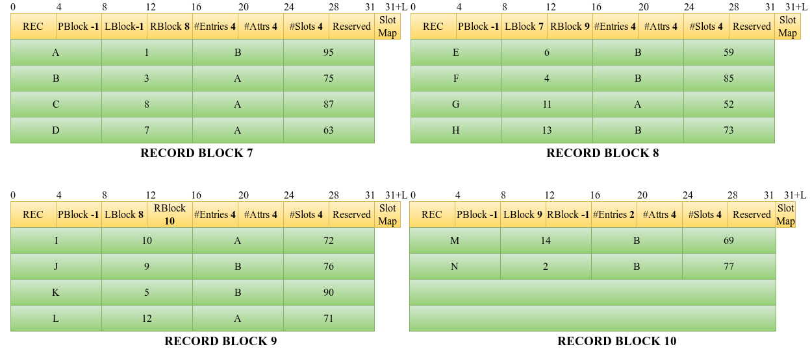

Now, let us understand the creation of B+ Tree in NITCbase in detail, and Insert and Search operations on it.

:::note PLEASE NOTE

Going forward, we will be assuming simpler values than the actual sizes of NITCbase in the interest of easier understanding.

We will be taking the size of a [record block](../Design/Physical%20Layer.md#record-block-structure) as 320 bytes analogous to the 2048 bytes in NITCbase. Therefore, keeping all other factors the same, the number of slots per block would be 4.

$$
\#Slots = L = \left \lfloor \frac {320 - 32} {((16 * \#Attributes(K)) + 1)} \right \rfloor
\\ = \left \lfloor \frac {288} {((16 * 4 + 1)} \right \rfloor = 4
$$

Additionally, we will be taking the maximum number of entries in an [internal index block](../Design/Physical%20Layer.md#internal-index-block-structure) to be **4** and [leaf index block](../Design/Physical%20Layer.md#leaf-index-block-structure) to be **3**.

:::

Consider a Relation `Student (Name, Roll No, Batch, Marks)` with 4 attributes. An index is to be created on the attribute `Roll No`. The records of the relation are as follows.

- **(Name, Roll No, Batch, Marks)**
  1. **(A, 1, B, 95)**
  1. **(B, 3, A, 75)**
  1. **(C, 8, A, 87)**
  1. **(D, 7, A, 63)**
  1. **(E, 6, B, 59)**
  1. **(F, 4, B, 85)**
  1. **(G, 11, A, 52)**
  1. **(H, 13, B, 73)**
  1. **(I, 10, A, 72)**
  1. **(J, 9, B, 76)**
  1. **(K, 5, B, 90)**
  1. **(L, 12, A, 71)**
  1. **(M, 14, B, 69)**
  1. **(N, 2, B, 77)**

We have 14 records. Hence, the number of record blocks required can be found as below.

$$
\#RecordBlocks = \left \lceil \frac {14} {4} \right \rceil = 4
$$

### Create Index

As discussed in the [Physical Layer](../Design/Physical%20Layer.md), each [attribute catalog entry](../Design/Physical%20Layer/#attribute-catalog) contains the `RootBlock` field which stores the root block number of the B+ Tree if there is an index created on the attribute or -1 otherwise.

In order to create the index, we begin by getting a free leaf index block, say **L1** allocated for the root block. We then update `RootBlock` in the attribute catalog entry.

Then, we iteratively insert all the values from the record into the index. We will cover the insertion algorithm next.

### Insertion in B+ Tree

Considering the simplified version of B+ Tree implementation similar to NITCbase, the algorithmic procedure for insertion is given below.

As noted above, for the purpose of illustration, we are assuming here that:

1.  an internal index block can store at most 4 indices, and
2.  a leaf index block can store at most 3 indices

#### Algorithm:

1. Find the correct leaf index block, say X, where the key value has to be inserted by traversing down the tree starting from the root block.
2. Create a temporary array of indices containing entries of X. Insert the entry corresponding to the key value in the array maintaining sorted order.
   1. If the size of indices array<=3 on insertion, i.e leaf is not full, overwrite the leaf index block X with entries of the array.
   2. If the size of indices array=4, i.e leaf is full, get a new free leaf index block, say Y. Distribute the entries in indices array evenly between X and Y. X contains the first two entries. Y contains the next 2 entries. We must add a new entry to the parent block, say P with child pointers to X and Y. The last value of X is to be added to P (P=parent of X).
      1. If X does not have a parent block:
         - Get a new free internal index block, i.e P, and insert the new entry. This is the case when the root is split. P is the new root block. Update the attribute catalog entry accordingly.
      2. Else
         - Insert the new entry in P using a temporary array of indices containing entries of P, maintaining sorted order.
         - If the size of indices array=5 on insertion of new entry, get a new free internal index block, say Q. Insert the first and last 2 entries in P and Q respectively. Also, insert the middle entry in the parent block above with child pointers to P and Q (Why? to propagate key values up the tree) by repeating the algorithm from step 2.ii.a (X=P, P=parent block of P).

We need to insert the following entries, a set of key values of the attribute `RollNo` along with their corresponding record pointers i.e record-id(Block number, Slot number) in a sequential manner.

- **(Attribute Value,(Block#, Slot#))**
  1. **(1, (7, 0))**
  1. **(3, (7, 1))**
  1. **(8, (7, 2))**
  1. **(7, (7, 3))**
  1. **(6, (8, 0))**
  1. **(4, (8, 1))**
  1. **(11, (8, 2))**
  1. **(13, (8, 3))**
  1. **(10, (9, 0))**
  1. **(9, (9, 1))**
  1. **(5, (9, 2))**
  1. **(12, (9, 3))**
  1. **(14, (10, 0))**
  1. **(2, (10, 1))**

Before the first entry insertion is performed in a B+ tree, the attribute catalog entry is obtained from the attribute cache and the root block number of the attribute is checked. If it is not -1, we proceed further. The first entry will always be a leaf entry.

#### Insert 1, 3, 8

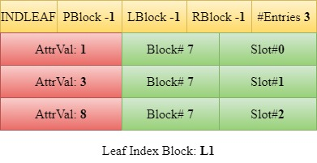

When 1 is to be inserted, a temporary array of indices containing the entry is created. The purpose of the array is to ensure all the entries are in sorted order. Since the size of the array is less than three, we rewrite the entries of the leaf index block in the sorted order from the array. The header of the block will be updated. 
Similarly, 3 and 8 are inserted. The parent block (`PBlock`) value remains -1 throughout these insertions as there is no parent block introduced in the B+ tree yet.

#### Insert 7

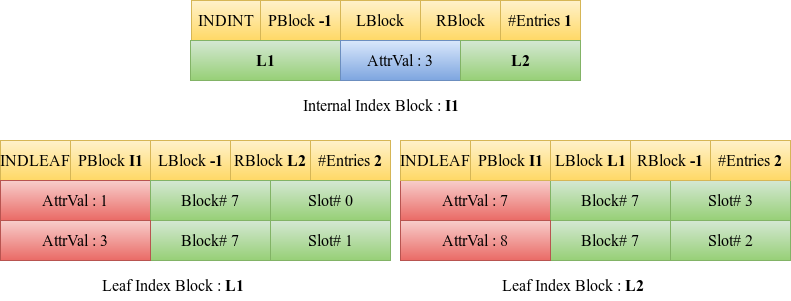

When the entry 7 is to be inserted, the entries are sorted in the array. However, it cannot be inserted or written into the same block L1 as now the existing leaf block has 3 entries i.e the leaf block is full. A new leaf block, L2 is hence obtained.

Iterate through all the sorted four entries. L1 is overwritten by the first two entries (the first half of the entries) of current block L1 and the next two entries are written into the new leaf block, L2. The headers of both the blocks are updated to incorporate the changes. The `RBlock` value of L1 is set as L2 and the `LBlock` value of L2 is set as L1. This is to maintain a linked list of leaf blocks.

A parent block is now required since there has been a split. A new internal index block, I1 is obtained for the same. The last value of the first block obtained on splitting the node, in this example the value 3 is made the entry of the internal index block. This does not violate the requirement that the maximum number of entries in an internal index block is four.

The left child and right child of this new internal index block are set as L1 and L2 respectively. The parent block value of the child blocks is updated as I1.

The attribute catalog will be updated with the changes including the new root block number.

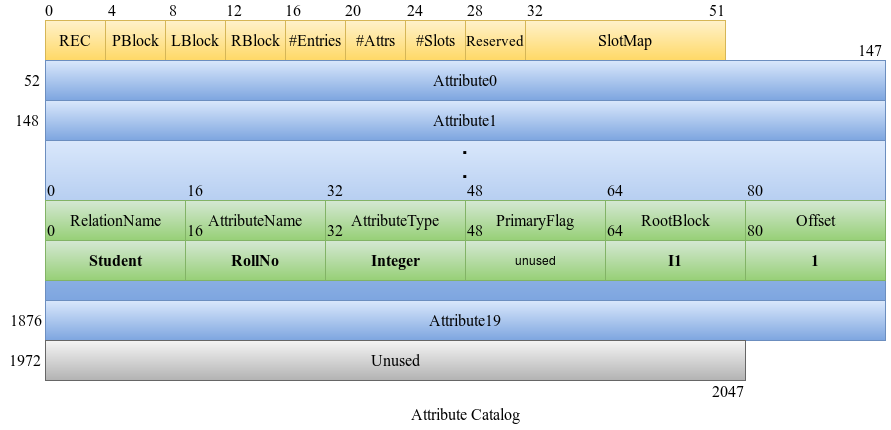

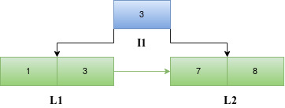

#### Insert 6

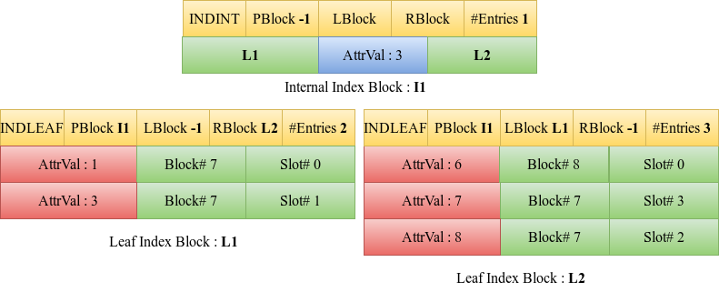

When 6 is to be inserted, we traverse down the tree starting from the root block, I1 to find the appropriate leaf index block. Since 6 is greater than 3, we traverse down to the right child of I1. As seen previously, the entries are sorted and since the maximum number of entries in a leaf block is not violated, the entries including the new entry 6 are written back into the block L2 and the number of entries in the header of L2 is updated.

#### Insert 4

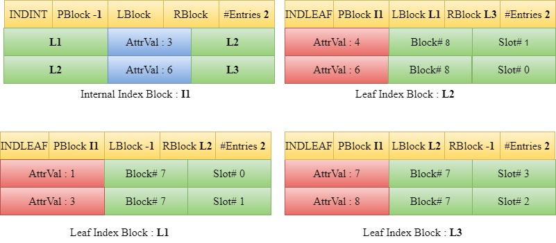

When 4 is to be inserted, we traverse down the tree starting from the root block I1 to find the appropriate leaf index block. Since 4 is greater than 3, we traverse down to the right child of I1. The entries are sorted. However, in this case, the number of entries in the leaf block will become greater than three if the entry 4 is to be included in L2. Hence a new leaf block, L3 is introduced. L2 is overwritten with the first half of the sorted entries in the array \[4,6\] and the rest \[7,8\] are written into L3. The `LBlock` and `RBlock` values of the blocks are updated to maintain the linked list.

Since L2 already has a parent block I1 and the number of entries in the parent block is less than four, the last value in the current L2 is the new entry to the parent block. The parent block entries are then sorted and written back into I1. The number of entries in I1 is incremented. The left child and right child of the new entry 6 in the parent block are set as L2 and L3 respectively.

The parent block of L3 is set as I1.

#### Insert 11

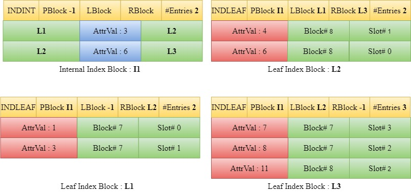

When 11 is to be inserted, we traverse down the tree starting from the root block I1 to find the appropriate leaf index block. Since 11 is greater than 6, we traverse down to the right child of 6 in I1. The entries in L3 and the new entry 11 are sorted. Since the maximum number of entries in a leaf block is not violated, the entries are written back into the block L3 and the number of entries in the header of L3 is updated.

#### Insert 13

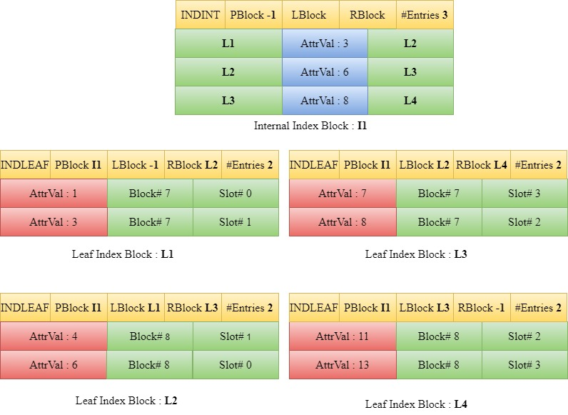

When 13 is to be inserted, we traverse down the tree starting from the root block I1 to find the appropriate leaf index block. Since 13 is greater than 6, we traverse down to the right child of 6 in I1. The entries are sorted. However, in this case, the number of entries in the leaf block L3 will become greater than three if the entry 13 is to be included. Hence a new leaf block, L4 is introduced. L3 is overwritten with the first half of the sorted entries in the array \[7,8\] and the rest \[11,13\] are written into L4. The `LBlock` and `RBlock` values of the headers of the blocks are updated to maintain the linked list.

Since L3 already has a parent block I1 and the number of entries in the parent block is less than four, the last value in the current L3 is the new entry to the parent block. This new entry along with the current entries in I1 are sorted. The sorted entries are then written back into I1 and the number of entries in I1 is incremented. The left child and right child of the entry 8 in the parent block are set as L3 and L4 respectively.

The parent block of L4 is set as I1.

#### Insert 10

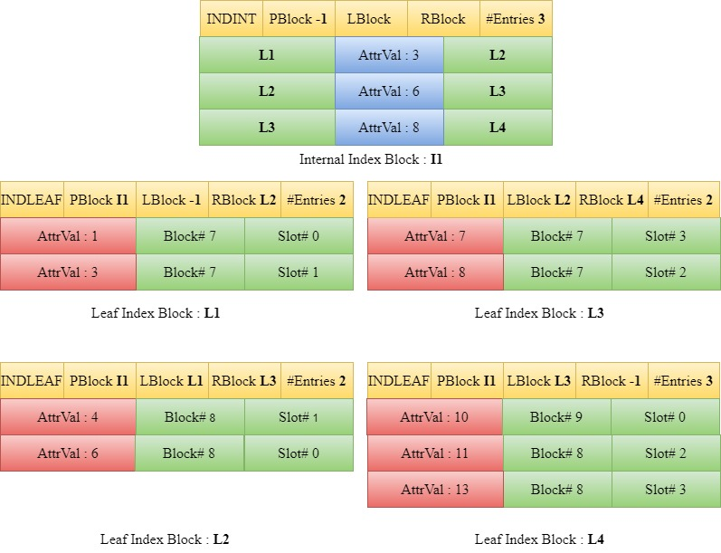

When 10 is to be inserted, we traverse down the tree starting from the root block I1 to find the appropriate leaf index block. Since 10 is greater than 8, we traverse down to the right child of 8 in I1. The entries in L4 along with the new entry 10 are sorted and since the maximum number of entries in a leaf block is not violated, the entries are written back into the block L4 and the number of entries in the header of L4 is updated.

#### Insert 9

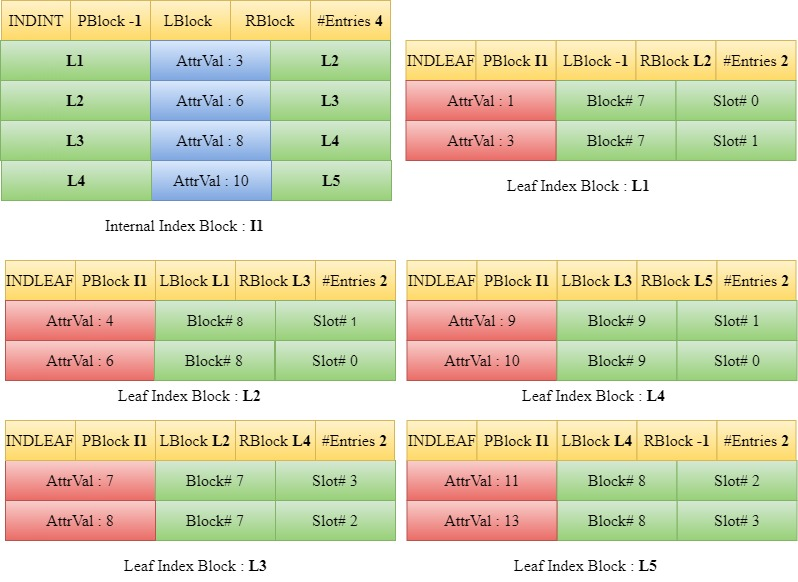

When 9 is to be inserted, we traverse down the tree starting from the root block I1 to find the appropriate leaf index block. Since 9 is greater than 8, we traverse down to the right child of 8 in I1 which is L4. The entries are sorted. However, in this case, the number of entries in the leaf block L4 will become greater than three if the entry 9 is to be included. Hence, a new leaf block L5 is introduced. The first half of the sorted entries in the array \[9,10\] are set in the block L4 and the rest \[11,13\] are set in L5. The `LBlock` and `RBlock` values of the headers of the blocks are updated to maintain the linked list.

Since L4 already had a parent block I1 and the number of entries in the parent block is less than four, we take the last value in the current L4 and the current entries in I1 into a temporary array for the purpose of sorting. The sorted entries are then written back into I1 and the number of entries in I1 is incremented. The left child and right child of the entry 10 in the parent block are set as L4 and L5 respectively.

The parent block of L5 is set as I1.

#### Insert 5

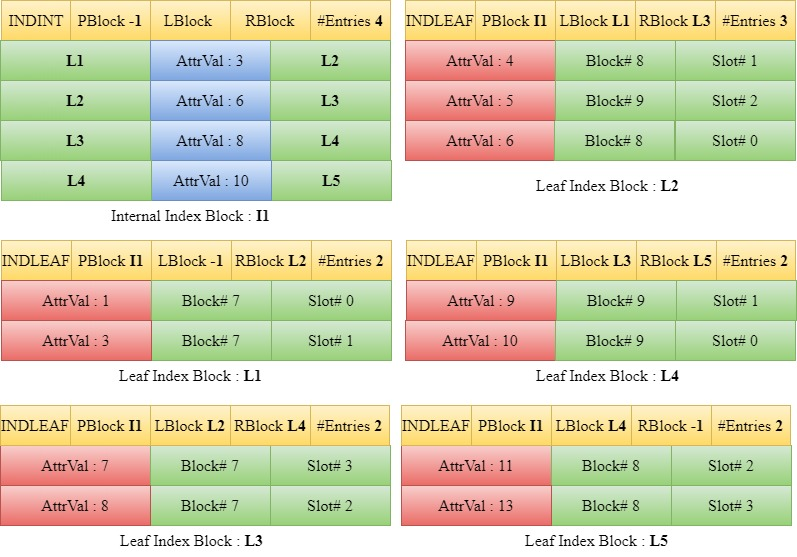

When 5 is to be inserted, we traverse down the tree starting from the root block I1 to find the appropriate leaf index block. Since 5 is greater than 3 but less than 6, we traverse down to the left child of 6 in I1 which is L2. The entries in L2 along with the new entry 5 are sorted and since the maximum number of entries in a leaf block is not violated, the entries are written back into the block L2 and the number of entries in the header of L2 is updated.

#### Insert 12

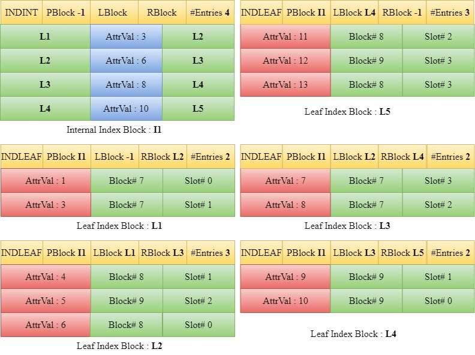

When 12 is to be inserted, we traverse down the tree starting from the root block I1 to find the appropriate leaf index block. Since 12 is greater than 10, we traverse down to the right child of 10 in I1 which is L5. The entries in L5 along with the new entry 12 are sorted and since the maximum number of entries in a leaf block is not violated, the entries are written back into the block L5 and the number of entries value in the header of L5 is updated.

#### Insert 14

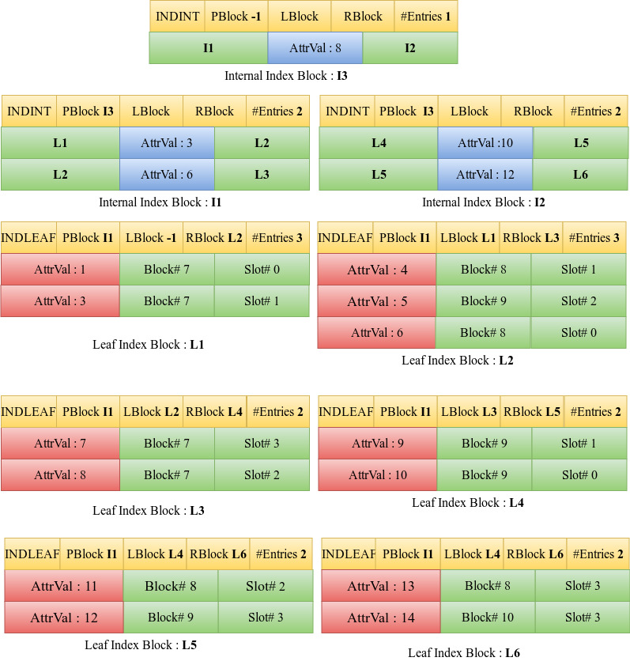

When 14 is to be inserted, we traverse down the tree starting from the root block I1 to find the appropriate leaf index block. Since 14 is greater than 10, we traverse down to the right child of 10 in I1 which is L5. The entries are sorted. However, in this case, the number of entries in the leaf block L5 will become greater than three if the entry 14 is to be included. Hence a new leaf block, L6 is introduced. L5 is overwritten by the first half of the sorted entries in the array \[11,12\] and the rest \[13,14\] are written into L6. The `LBlock` and `RBlock` values of the blocks are updated to maintain the linked list.

L5 already has a parent block I1. The last value in L5 and the current entries in I1 are sorted. However, block I1 has reached the maximum number of entries possible in an internal index block i.e the parent block is full. Hence we obtain a new internal index block, I2. We copy the first two entries \[3,6\] from the sorted entries into the old internal block I1 and the last two entries \[10,12\] are copied into the new internal block I2. The `#Entries` attribute of these two blocks is updated and the `PBlock` attribute of both are kept the same i.e -1.

Since the previous parent block has now been split, a new internal index block, I3 is introduced. The middle value (8) of the previous root which had been stored in a temporary variable is now inserted into I3. The left child and right child of 8 in I3 are set as I1 and I2 respectively. The number of entries in the new internal index block is incremented to 1. The parent block of I1 and I2 is set to I3.

The `RootBlock` number of this B+ Tree in the attribute catalog is updated to the new root block number.

#### Insert 2

Entry 2 is inserted in a similar manner as demonstrated in the previous steps.

### Search on B+ Tree

Search is done on attributes that are indexed to get a record hit based on certain search conditions given (i.e `op`, `attrval`). `op` represents one amongst the 6 relational operators(`EQ`, `LE`, `LT`, `GE`, `GT`, `NE` corresponds to equal, less than equal, less than, greater than equal, greater than, not equal operators respectively). `attrval` denotes the attribute value that is to be checked against the operator. The attribute cache provides the information on previous hit i.e index of the previous record that satisfied the search condition, and it is modified if a new record hit is encountered. record-id (block number, slot number) corresponding to the record satisfying search condition is returned.

A concise algorithmic procedure for search on a B+ Tree implemented in NITCbase is given below.

#### Algorithm:

1. Get `searchIndex` from the [attribute cache](../Design/Cache%20Layer/AttrCacheTable.md) and store it in the variable `sIndex`. `searchIndex` stores the block number of the corresponding leaf index block and index number, which is the offset of the index in that block. It represents the previous hit in the leaf blocks, i.e the previous record that satisfied the search condition. This is used to take advantage the linked list structure of leaf blocks after the first hit.
2. Reset the value of `searchIndex` in the attribute cache to (-1, -1). This will be set to the correct index-id if an entry satisfying `op` for given `attrval` is found in the course of the search.
3. If `sIndex` is (-1, -1), i.e the search is done for the first time :

   1. Traverse down the tree starting from the root, to find the first record in the leaf block that satisfies the search condition. Set `searchIndex` in the attribute cache to this new index found in the leaf block. Return the record-id of the record that satisfied the search condition.
   2. If there is no record that satisfies the search condition, return (-1, -1) as the record-id.

   Else (A record satisfying search condition was already found):

   1. Set the variable block = `sIndex`.`block` and index = `sIndex`.`slot` + 1.  If index exceeds the number of entries present in the leaf index block, update `block` to its right block and set `index` = 0.
   2. Scan the leaf blocks linearly until from the current (`block`, `index`) until you find a record that satisfies the search condition. Set `searchIndex` in the attribute cache to this new index found in the leaf block. Return the record-id of the record that satisfied the search condition.
   3. If blocknum reaches -1, it implies that all the leaf blocks have been scanned, and search is completed. Return (-1, -1) as the record-id.

**Let us try to understand the trace of a search query on the B+ Tree implemented by the series of insert operations in the above section.**

Consider a query to fetch the student records of all the students with RollNo >= 11. Here, the search condition represented in the form (`op`, `attrval`) is **(GE, 11)**.

- At first we retrieve the value of `searchIndex` from the attribute cache and store it in the variable `sIndex`. Then, we reset the value of `searchIndex` in the attribute cache to (-1, -1). This will be set to the correct index id if a record satisfying our condition is found in course of the search. Since it is the first search, the value retrieved and stored earlier in `sIndex` would be invalid.

- Traverse down the tree starting from the root, to find the first record in the leaf block that satisfies the search condition (i.e. `RollNo` >= 11). First such record is that of student with roll number 11. Since this is the first entry in the Leaf Block L5, `searchIndex` in the attribute cache is set to this new index found, i.e (L5, 0). L5 is block number of the corresponding leaf index block and 0 is the offset of the index in that block. The record-id of this record that succeeded in satisfying the search condition, (Block# 8, Slot# 2) is returned.

- Now, we proceed to the second iteration of search. `sIndex` is updated with the new value retrieved from `searchIndex` field of attribute cache. `searchIndex` in the attribute cache is then reset to (-1, -1). Since, there has been a previous hit, i.e. a previous record that satisfied the search condition, `sIndex` would contain a valid search index.

- Set the variable `block` = `sIndex`.`block` and `index` = `sIndex`.slot + 1. 
  Here, that would be `block` = L5 and `index` = 0+1 = 1 
  We linearly scan the leaf blocks from this point. As we begin, we get the next record that satisfies our search condition, the record with `RollNo`=12 which lies at the offset 1 in the Leaf Index Block L5. `searchIndex` in the attribute cache is set to this new index found, i.e (L5, 1) and the record-id **(Block# 9, Slot# 3)** is returned.

- Now, we proceed to the third iteration of search. `sIndex` is updated with the new value retrieved from `searchIndex` field of attribute cache. Then, `searchIndex` of attribute cache is reset to (-1, -1). `sIndex` would contain a valid search index as there has been a previous hit. i.e `sIndex` = (L5, 1) 
  We set block = L5 and increment the index, i.e index = 1+1 = 2. 
  From, the header of the Leaf Block L5, we observe that the number of entries is 2 which implies that the maximum value of offset possible is 1. So, update the block to its right block and set index = 0. Therefore, block = L6 and index = 0.

- As leaf blocks are scanned linearly from this block, we immediately get the next hit at RollNo 13. `searchIndex` field in the attribute cache is updated to this new index found (L6, 0). The record-id of the corresponding record **(Block# 8, Slot# 3)** is returned.

- On proceeding with the next iteration of Search, `sIndex` is updated with `searchIndex` field of attribute cache and then `searchIndex` is reset to (-1, -1). So, `sIndex` = (L6, 0)

- We set block = L6 and index = 0+1 = 1 
  On beginning linear scan from this point, we get a hit at `RollNo` 14. `searchIndex` field in the attribute cache is updated to (L6, 1) and the corresponding record-id **(Block# 10, Slot# 0)** is returned.

- We proceed onto the next iteration of search. `sIndex` is updated with the `searchIndex` field of attribute cache and `searchIndex` is reset to (-1, -1). So, `searchIndex` = (L6, 1)

- Set `block` = L6 and `index` = 1+1 = 2. 
  Header of the block L6 indicates that number of entries is 2 and so the maximum value of offset possible is 1. So, update `block` to its right block and set `index` = 0. Since L6 is the last and rightmost leaf index block in our linked list, `RBlock` of L6 is -1. 
  block = -1

- This implies that all the leaf blocks have been scanned, and search is completed. Return (-1, -1) as the record-id to indicate this.
